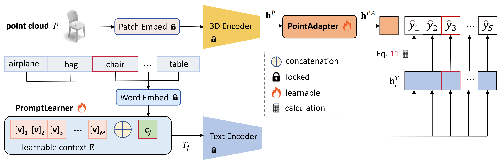

This repository is the official implementation of "Parameter-efficient Prompt Learning for 3D Point Cloud Understanding", created by [Hongyu Sun](https://github.com/auniquesun), Yongcai Wang, Wang Chen, Haoran Deng and Deying Li.



Our work presents a parameter-efficient prompt tuning method, named PPT, to adapt a large multi-modal model for 3D point cloud 
understanding. Existing strategies are quite expensive in computation and storage, and depend on time-consuming prompt engineering. 
We address the problems from three aspects. Firstly, a PromptLearner module is devised to replace hand-crafted prompts with 
learnable contexts to automate the prompt tuning process. Then, we lock the pre-trained backbone instead of adopting the full 
fine-tuning paradigm to substantially improve the parameter efficiency. Finally, a lightweight PointAdapter module is arranged 
near target tasks to enhance prompt tuning for 3D point cloud understanding. Comprehensive experiments are conducted to 
demonstrate the superior parameter and data efficiency of the proposed method. 
Meanwhile, we obtain new records on 4 public datasets and multiple 3D tasks, i.e., point cloud recognition, few-shot learning, 
and part segmentation. 

## Environment
### Package Setup
* Ubuntu 20.04
* Python 3.8.16
* PyTorch 1.12.0
* CUDA 11.6
* torchvision 0.13.0
* timm 0.4.12
* wandb 0.13.3
* pueue & pueued 2.0.4

```shell
  conda create -n ppt python=3.8.16
  codna activate ppt

  pip install torch==1.12.0+cu116 torchvision==0.13.0+cu116 --extra-index-url https://download.pytorch.org/whl/cu116
  pip install -r requirements.txt
```

`pueue` is a shell command management software, we use it for scheduling the model pre-training & fine-tuning tasks, please refer to the [official page](https://github.com/Nukesor/pueue) for installation and basic usage. 
We recommend this tool because under its help you can run the experiments at scale thus save your time. 

### W&B Server Setup
We track the model training and fine-tuning with W&B tools. The official W&B tools may be slow and unstable since 
they are on remote servers, we install the local version by running the following command. 

```shell
  docker run --rm -d -v wandb:/vol -p 28282:8080 --name wandb-local wandb/local:0.9.41
```

If you do not have Docker installed on your computer before, referring to the [official document](https://docs.docker.com/engine/install/ubuntu/) to finish Docker installation on Ubuntu.

## Datasets & Weights
1. Our work used 4 public datasets, you can download them following this [link](https://pan.baidu.com/s/1JmefoMj8nNz6K1KgbyLhLQ?pwd=jrti) (code: `jrti`). 
    1. ModelNet10
    2. ModelNet40
    3. ScanObjectNN
    4. ShapeNetPart

2. Extract the compressed files and organize their directories as follows
    ```
    |- PPT
    |---- data
    |-------- ModelNet10
    |-------- ModelNet40
    |-------- ScanObjectNN
    |-------- ShapeNetPart
    ```
    The `data` directory is at the same level with `models`, `scripts`, etc.

3. We use the weights of representative 3D encoders pre-trained by [ULIP](https://github.com/salesforce/ULIP), please refer to the ULIP project and download the [weights](https://console.cloud.google.com/storage/browser/sfr-ulip-code-release-research;tab=objects?prefix=&forceOnObjectsSortingFiltering=false). 
    1. pointbert.pt
    2. pointmlp.pt
    3. pointnet2_ssg.pt
    4. pointnet2_msg_1kpts.pt

4. In PPT, only the PromptLearner and PointAdapter modules are learnable. Here we release the well-trained [weights](https://pan.baidu.com/s/1BrjHvW57mG6izZ_-gV654A?pwd=h3tx) of these two modules and corresponding running [logs]( https://pan.baidu.com/s/1BrjHvW57mG6izZ_-gV654A?pwd=h3tx). 
  - NOTE: SONN is short for ScanObjectNN

    |   Task    | Model | Config | Dataset | Download | 
    | :--- | :---: | :---: | :---: | :---: |
    | Recognition | PPT-Base | [recog_mn40](scripts/recog/cls-pointbert-mn40-32v-middle-dr04-h0-1.sh) | ModelNet40 | [weights & logs, code: h3tx](https://pan.baidu.com/s/1BrjHvW57mG6izZ_-gV654A?pwd=h3tx) |
    | Recognition | PPT-Base | [recog_sonn_obj](scripts/recog/cls-pointbert-sonn_objonly-32v-front-dr07-h0-1.sh) | SONN_OBJ | [weights & logs, code: h3tx](https://pan.baidu.com/s/1BrjHvW57mG6izZ_-gV654A?pwd=h3tx) |
    | Recognition | PPT-Base | [recog_sonn_bg](scripts/recog/cls-pointbert-sonn_objbg-32v-middle-dr06-h0-1.sh) | SONN_BG | [weights & logs, code: h3tx](https://pan.baidu.com/s/1BrjHvW57mG6izZ_-gV654A?pwd=h3tx) |
    | Recognition | PPT-Base | [recog_sonn_pb](scripts/recog/cls-pointbert-sonn_hardest-32v-middle-dr07-h0-1.sh) | SONN_PB | [weights & logs, code: h3tx](https://pan.baidu.com/s/1BrjHvW57mG6izZ_-gV654A?pwd=h3tx) |
    | Recognition | PPT-FFN | [recog_mn40](scripts/recog/cls-pointbert-mn40-32v-middle-mlp_head-1.sh) | ModelNet40 | [weights & logs, code: h3tx](https://pan.baidu.com/s/1BrjHvW57mG6izZ_-gV654A?pwd=h3tx) |
    | Recognition | PPT-FFN | [recog_sonn_obj](scripts/recog/cls-pointbert-sonn_objonly-32v-middle-mlp_head-1.sh) | SONN_OBJ | [weights & logs, code: h3tx](https://pan.baidu.com/s/1BrjHvW57mG6izZ_-gV654A?pwd=h3tx) |
    | Recognition | PPT-FFN | [recog_sonn_bg](scripts/recog/cls-pointbert-sonn_objbg-32v-middle-mlp_head-1.sh) | SONN_BG | [weights & logs, code: h3tx](https://pan.baidu.com/s/1BrjHvW57mG6izZ_-gV654A?pwd=h3tx) |
    | Recognition | PPT-FFN | [recog_sonn_pb](scripts/recog/cls-pointbert-sonn_hardest-32v-middle-mlp_head-1.sh) | SONN_PB | [weights & logs, code: h3tx](https://pan.baidu.com/s/1BrjHvW57mG6izZ_-gV654A?pwd=h3tx) |
    | Recognition | PPT-PTB | [recog_mn40](scripts/recog/cls-pointbert-mn40-32v-middle-dr03-h3-1.sh) | ModelNet40 | [weights & logs, code: h3tx](https://pan.baidu.com/s/1BrjHvW57mG6izZ_-gV654A?pwd=h3tx) |
    | Recognition | PPT-PTB | [recog_sonn_obj](scripts/recog/cls-pointbert-sonn_objonly-32v-front-dr07-h3-1.sh) | SONN_OBJ | [weights & logs, code: h3tx](https://pan.baidu.com/s/1BrjHvW57mG6izZ_-gV654A?pwd=h3tx) |
    | Recognition | PPT-PTB | [recog_sonn_bg](scripts/recog/cls-pointbert-sonn_objbg-32v-middle-dr09-h3-1.sh) | SONN_BG | [weights & logs, code: h3tx](https://pan.baidu.com/s/1BrjHvW57mG6izZ_-gV654A?pwd=h3tx) |
    | Recognition | PPT-PTB | [recog_sonn_hardest](scripts/recog/cls-pointbert-sonn_hardest-32v-middle-dr05-h3-1.sh) | SONN_PB | [weights & logs, code: h3tx](https://pan.baidu.com/s/1BrjHvW57mG6izZ_-gV654A?pwd=h3tx) |
    | Few-shot | PPT-FFN |  [1-shot](scripts/fewshot/pointbert-mn40-32v-middle-mlp_head-1s-3.sh) | ModelNet40 | [weights & logs, code: h3tx](https://pan.baidu.com/s/1BrjHvW57mG6izZ_-gV654A?pwd=h3tx) |
    | Few-shot | PPT-FFN |  [2-shot](scripts/fewshot/pointbert-mn40-32v-middle-mlp_head-2s-1.sh) | ModelNet40 | [weights & logs, code: h3tx](https://pan.baidu.com/s/1BrjHvW57mG6izZ_-gV654A?pwd=h3tx) |
    | Few-shot | PPT-FFN |  [4-shot](scripts/fewshot/pointbert-mn40-32v-middle-mlp_head-4s-1.sh) | ModelNet40 | [weights & logs, code: h3tx](https://pan.baidu.com/s/1BrjHvW57mG6izZ_-gV654A?pwd=h3tx) |
    | Few-shot | PPT-FFN |  [8-shot](scripts/fewshot/pointbert-mn40-32v-middle-mlp_head-8s-1.sh) | ModelNet40 | [weights & logs, code: h3tx](https://pan.baidu.com/s/1BrjHvW57mG6izZ_-gV654A?pwd=h3tx) |
    | Few-shot | PPT-FFN |  [16-shot](scripts/fewshot/pointbert-mn40-32v-middle-mlp_head-16s-4.sh) | ModelNet40 | [weights & logs, code: h3tx](https://pan.baidu.com/s/1BrjHvW57mG6izZ_-gV654A?pwd=h3tx) |
    | Few-shot | PPT-FFN |  [1-shot](scripts/fewshot/pointbert-sonn_hardest-32v-middle-mlp_head-1s-1.sh) | SONN_PB | [weights & logs, code: h3tx](https://pan.baidu.com/s/1BrjHvW57mG6izZ_-gV654A?pwd=h3tx) |
    | Few-shot | PPT-FFN |  [2-shot](scripts/fewshot/pointbert-sonn_hardest-32v-middle-mlp_head-2s-1.sh) | SONN_PB | [weights & logs, code: h3tx](https://pan.baidu.com/s/1BrjHvW57mG6izZ_-gV654A?pwd=h3tx) |
    | Few-shot | PPT-FFN |  [4-shot](scripts/fewshot/pointbert-sonn_hardest-32v-middle-mlp_head-4s-1.sh) | SONN_PB | [weights & logs, code: h3tx](https://pan.baidu.com/s/1BrjHvW57mG6izZ_-gV654A?pwd=h3tx) |
    | Few-shot | PPT-FFN |  [8-shot](scripts/fewshot/pointbert-sonn_hardest-32v-middle-mlp_head-8s-1.sh) | SONN_PB | [weights & logs, code: h3tx](https://pan.baidu.com/s/1BrjHvW57mG6izZ_-gV654A?pwd=h3tx) |
    | Few-shot | PPT-FFN |  [16-shot](scripts/fewshot/pointbert-sonn_hardest-32v-middle-mlp_head-16s-1.sh) | SONN_PB | [weights & logs, code: h3tx](https://pan.baidu.com/s/1BrjHvW57mG6izZ_-gV654A?pwd=h3tx) |
    | PartSeg | PPT | [partseg](scripts/partseg/partseg-pointbert-shapepart-32v-middle-2.sh) | ShapeNetPart | [weights & logs, code: h3tx](https://pan.baidu.com/s/1BrjHvW57mG6izZ_-gV654A?pwd=h3tx) |
    | Linear Probe | ULIP | [lp-mn40](scripts/lin_probe/fs-mn40-pointbert-summary-1.sh) | ModelNet40 | [weights & logs, code: h3tx](https://pan.baidu.com/s/1BrjHvW57mG6izZ_-gV654A?pwd=h3tx) |
    | Linear Probe | ULIP | [lp-sonn_pb](scripts/lin_probe/fs-sonn-pointbert-summary-1.sh) | SONN_PB | [weights & logs, code: h3tx](https://pan.baidu.com/s/1BrjHvW57mG6izZ_-gV654A?pwd=h3tx) |

## Usage
The length of learnable contexts is 32 and PointBERT is the 3D encoder by default. We use `cls`, `fewshot` and `partseg` denotes the 3D recognition, few-shot learning and shape part segmentation task, respectively. 

For different tasks, you can refer to the `Config` and `Dataset` columns in the above table to get complete settings of each experiment.  

### Point Cloud Recognition
1. To train and evaluate the recognition model on ModelNet40, run, e.g.
```shell
./scripts/recog/cls-pointbert-mn40-32v-middle-dr03-h3-1.sh
```

### Few-shot Classification
1. To train and evaluate the few-shot learning on ScanObjectNN, run, e.g. 
```shell
./scripts/fewshot/pointbert-sonn_hardest-32v-middle-mlp_head-1s-1.sh
```

### Part Segmentation
1. To train and evaluate the part segmentation on ShapeNetPart, run, e.g. 
```shell
./scripts/partseg/partseg-pointbert-shapepart-32v-middle-2.sh
```

### Linear Probe
1. To inspect the linear probe performances of ULIP on ModelNet40, run, e.g.
```shell
./scripts/lin_probe/fs-mn40-train-feat-pointbert-1.sh # extract features for training set
./scripts/lin_probe/fs-mn40-test-feat-pointbert-1.sh  # extract features for test set
./scripts/lin_probe/fs-mn40-pointbert-summary-1.sh    # evaluate the performances of linear probe
```

## Citation
```bibtex
@inproceedings{sun24ppt,
  title={Parameter-efficient Prompt Learning for 3D Point Cloud Understanding},
  author={Hongyu Sun, Yongcai Wang, Wang Chen, Haoran Deng and Deying Li},
  booktitle={ICRA submission},
  year={2024}
}
```

## Acknowledgement
Our implementation is partially inspired by the following projects, thanks to their great work  
1. [CoOp](https://github.com/KaiyangZhou/CoOp/)
2. [ULIP](https://github.com/salesforce/ULIP)
3. [CLIP](https://github.com/openai/CLIP)

## Contact
If you have any question about our work, please create new or search related issues in this repository. 